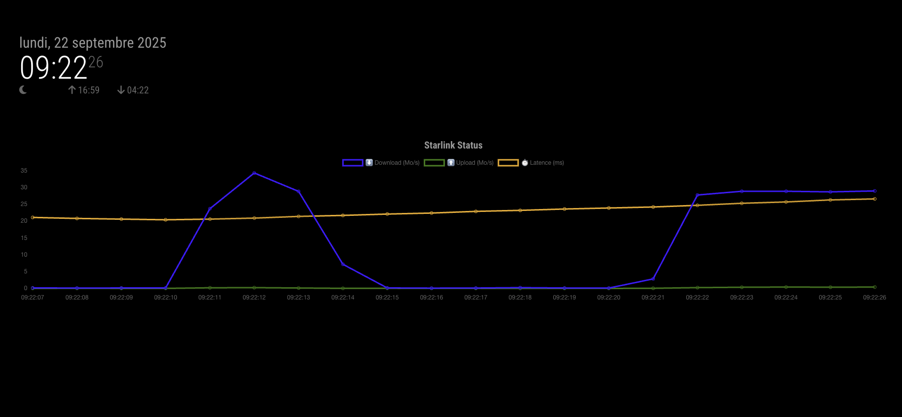

# MagicMirror2 Module: MMM-Local-Starlink-Status-Graph

```sh
  __  __ __  __ __  __        _                     _        _____ _             _ _       _           _____ _        _                     _____                 _
 |  \/  |  \/  |  \/  |      | |                   | |      / ____| |           | (_)     | |         / ____| |      | |                   / ____|               | |
 | \  / | \  / | \  / |______| |     ___   ___ __ _| |_____| (___ | |_ __ _ _ __| |_ _ __ | | _______| (___ | |_ __ _| |_ _   _ ___ ______| |  __ _ __ __ _ _ __ | |__
 | |\/| | |\/| | |\/| |______| |    / _ \ / __/ _` | |______\___ \| __/ _` | '__| | | '_ \| |/ /______\___ \| __/ _` | __| | | / __|______| | |_ | '__/ _` | '_ \| '_ \
 | |  | | |  | | |  | |      | |___| (_) | (_| (_| | |      ____) | || (_| | |  | | | | | |   <       ____) | || (_| | |_| |_| \__ \      | |__| | | | (_| | |_) | | | |
 |_|  |_|_|  |_|_|  |_|      |______\___/ \___\__,_|_|     |_____/ \__\__,_|_|  |_|_|_| |_|_|\_\     |_____/ \__\__,_|\__|\__,_|___/       \_____|_|  \__,_| .__/|_| |_|
                                                                                                                                                           | |
                                                                                                                                                           |_|
```

## Screenshot



## Description

This is a module for [MagicMirror²](https://magicmirror.builders/) that serves to see the status of your Starlink connection over time in a graph format. It fetches data from your Starlink router. This module use [@gibme/starlink](https://www.npmjs.com/package/@gibme/starlink) for fetching data from the Starlink router.

## Installation

### Install

1. In your terminal, go to the modules directory and clone the repository :

```bash
$ cd ~/MagicMirror/modules
$ git clone https://github.com/jboucly/MMM-Local-Starlink-Status-Graph.git
```

2. Go to directory of this module

```sh
$ cd MMM-Local-Starlink-Status-Graph
```

3. Install dependencies

```sh
$ npm ci
```

### Update

Go to the module directory and pull the latest changes:

```bash
$ cd ~/MagicMirror/modules/MMM-Local-Starlink-Status-Graph
$ git pull
```

## Configuration

To use this module, you have to add a configuration object to the modules array in the `config/config.js` file.

### Example configuration

Minimal configuration to use the module :

```js
{
    module: "MMM-Local-Starlink-Status-Graph",
    position: "middle_center"
},
```

Configuration with all options :

```js
{
    module: "MMM-Local-Starlink-Status-Graph",
    position: "middle_center",
    config: {
        title: 'Starlink Status',
        updateInterval: 30 * 1000,

        // Graph settings
        maxPoints: 20,
        chartHeight: 150,
        chartWidth: '100%',
        latencyColor: 'orange',
        downloadColor: 'blue',
        uploadColor: 'green'
    }
},
```

### Configuration options

| Option           | Possible values | Default         | Description                                                                                                         |
| ---------------- | --------------- | --------------- | ------------------------------------------------------------------------------------------------------------------- |
| `title`          | `string`        | Starlink Status | Title displayed above the graph                                                                                     |
| `updateInterval` | `number`        | 30 \* 1000      | Update interval in milliseconds                                                                                     |
| `maxPoints`      | `number`        | 20              | Maximum number of data points to display                                                                            |
| `chartHeight`    | `number`        | 150             | Height of the chart in pixels                                                                                       |
| `chartWidth`     | `string`        | 100%            | Width of the chart in string, you can set it to a specific pixel value (e.g. '400px') or a percentage (e.g. '100%') |
| `latencyColor`   | `string`        | orange          | Color for the latency line                                                                                          |
| `downloadColor`  | `string`        | blue            | Color for the download line                                                                                         |
| `uploadColor`    | `string`        | green           | Color for the upload line                                                                                           |

## Sending notifications to the module

| Notification     | Description                                                    |
| ---------------- | -------------------------------------------------------------- |
| `START_STARLINK` | Start the Starlink connection and begin monitoring its status. |
| `STARLINK_DATA`  | Send the current Starlink data to the module.                  |

## Developer commands

- `npm install` - Install dependencies.
- `npm run lint` - Run linting and formatter checks.
- `npm run lint:fix` - Fix linting and formatter issues.

## License

This project is licensed under the MIT License - see the [LICENSE](LICENSE.md) file for details.

## Changelog

All notable changes to this project will be documented in the [CHANGELOG.md](CHANGELOG.md) file.
